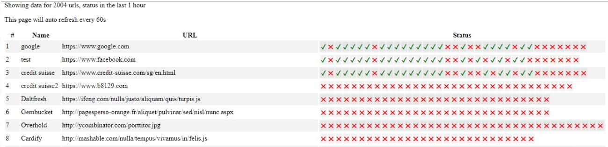

# service-monitor

Monitor a list of URLs periodically.

Features

* Accepts a CSV file containing a list of URLs and names
* Interval of the check is configurable.
* Exposes summary over the local port (defaults to 8080)

## Requirements
* Docker and docker-compose

## Getting Started

1. In the project root folder run `docker-compose up --build`
2. By default, the above command will run the server with `./example/sample.csv` and can be changed via the command argument passed in the `docker-compose.yml` file.

## Summary View

The service will also bind to `http://localhost:8080` where
a summary page is served like the below example


* This page will auto-refresh based on the interval time,
and one can hover over each sample for the status code/timestamp of the sample.

* If a JSON response is required one can pass the content-type header of "application/json".

## Service Monitor Arguments
These arguments can be passed as command-line arguments to service-monitor

### Possible Args:
```
usage: service-monitor [-h] [-i INTERVAL] [-ms METRIC_SPAN] [--log-level {INFO,DEBUG}] csv

positional arguments:
  csv                   Path to csv file with list of url(s)

optional arguments:
  -h, --help            show this help message and exit
  -i INTERVAL, --interval INTERVAL
                        Interval to check service health,in minutes (default:
                        10 min)
  -ms METRIC_SPAN, --metric-span METRIC_SPAN
                        Span of time to show metric data, in hours (default: 1
                        hour)
  --log-level {INFO,DEBUG}
                        Span of time to show metric data, in hours (default: 1
                        hour)
```

## Assumptions and limitations
* If the CSV has duplicated entries (i.e. the name, URL pair is the same) that row is skipped.
* The storage layer exists for recovery from crashes.
* The summary is read from storage via an optimized query that takes 0.1s @ 200,000 rows.
* The storage DB is not normalized, to avoid JOINS, in order the summary query (in this scenario it has shown to be faster)
* Currently this service will not check for pending tasks before shutting down or if cancelled.